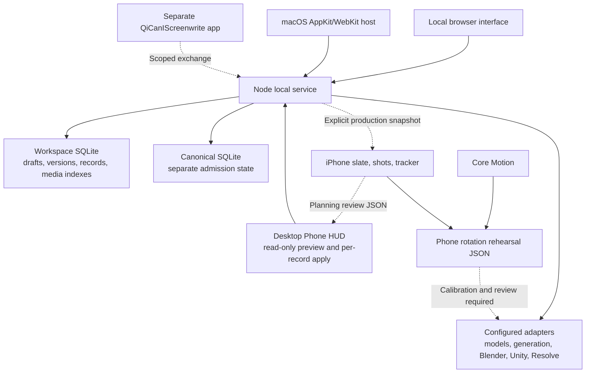

# Architecture and integration

QiMovi has a local desktop production workspace and a smaller native iPhone companion. They share the film-production model and explicit source references. They do not currently share a live database or automatic synchronization service.

Dashed edges are handoff boundaries. They do not imply automatic synchronization or a qualified external execution.

## Source layout

| Directory | Responsibility |
|---|---|
| `src/drifter/` | Current local filmmaking UI, including development, writing, Story Bible, budgets, storyboards, timeline, and connectors. The historical directory name does not restrict the app to one film. |
| `local/server/` | Loopback HTTP, local authentication, persistence, validation, production operations, and integration services. |
| `local/contracts/` | Record and exchange validation shared with workflow code. |
| `local/kernel/` | Vendored source for canonical admission state, separate from editable draft storage. |
| `local/integrations/` | DCC/editor exchange code and integration guidance. External applications remain separate. |
| `desktop/` | Swift AppKit/WebKit host and native media probe. |
| `script/` | Desktop packaging, runtime staging, icons, and dependency notices. |
| `iphone/QiMovi/` | SwiftUI production companion, local planning store, and Core Motion rehearsal. |
| `iphone/scripts/` | Standalone iOS Xcode-project generator and explicit local slate exporter. |
| `src/` and `supabase/` | Also retain inherited web/hosted code. The local entry uses `drifter.html` and `vite.local.config.ts`; it does not establish a hosted release. |

## Desktop state and authority

A project workspace lives outside the app bundle. `workspace.sqlite` stores editable records, immutable versions, request receipts, project metadata, and media indexes. `canonical.sqlite` stores separate admission state. `config.json` contains the private local owner credential.

`create-project` starts with a title and no screenplay, scenes, or inherited creative material. Saved development drafts can become a reviewed production attachment with exact screenplay and scene-plan references. A later draft edit does not silently replace that attachment.

Record writes use validation, expected versions, and replay identifiers. Conflicts preserve earlier state. The process lock allows one active owner of a workspace; source imports and backups run with the service stopped. A selected phase, generated artifact, imported contract, or planning review does not grant production, legal, financial, or release approval.

## Local authentication

The service binds to `127.0.0.1` and checks Host and Origin. Browser access uses the private owner token to obtain an HttpOnly, SameSite=Strict session cookie. Sessions expire after restart or their configured lifetime; a new owner login invalidates an older one.

The native Mac host starts its bundled service on an available loopback port, authenticates through a native request, and gives WebKit the session cookie. The raw owner token is not placed in the page or a URL. The CanIScreenwrite bridge has separate, scoped sessions; it does not inherit unrestricted owner authority.

This design is for a local owner. Exposing the service over a network or deploying the inherited hosted client requires a separate security and deployment design.

## Phone formats and state

| Schema | Direction | Meaning |
|---|---|---|
| `qimovi-phone-production/v1` | Into phone | A slate snapshot of projects, ordered shots, and tasks; desktop HUD exports include retained review baselines. |
| `qimovi-production-review/v1` | Out of phone | One project's planning proposal; `desktopApplied: false`, `productionApproval: false`. |
| `qimovi-phone-rotation/v1` | Out of phone | Timestamped orientation samples bound to a shot; `desktopPlaybackReady: false`. |

The Swift `Codable` models define the current fields. The generic phone importer accepts up to 20 MB, 100 projects, and 5,000 shots and 5,000 tasks per project. The UI holds an import preview until confirmation. Changed content for an existing project ID requires **Archive old plan and import**: the previous phone slate is written to `Import Archives/` before replacement. If the phone plan changes while review is open, confirmation fails and requires a fresh review. The phone does not merge the two plans.

The desktop HUD round trip uses smaller bounds: one selected project, 400 shots, 50 tasks, and 2 MiB JSON requests. A provided hash is a source reference, not a digital signature, proof of ownership, or independent rights verification.

Phone state is stored under Application Support at `QiMoviAlpha/Production`: `production-library.json`, `Camera/`, `Exports/`, and `Import Archives/`. Atomic library writes and camera saves use iOS file protection until first user authentication after boot. A failed camera save retains its pending take during the current process for retry. This is not a backup system.

Snapshot JSON does not transport image files. Optional thumbnail paths refer to resources already bundled under `Thumbnails/`. Public examples must use synthetic, cleared content.

## Desktop Phone HUD review and apply

Version `0.5.0-alpha.1` adds `local/server/phone-handoff.mjs` and the desktop Phone HUD. The owner-authenticated loopback service provides `GET /api/phone/export`, `POST /api/phone/preview`, and `POST /api/phone/apply`. The narrower CanIScreenwrite session does not authorize these routes. Files move through the user's chosen transfer method; no network pairing or live synchronization is established.

Export reads the current resolved project and saved direction records. Its optional `desktopBaseline` retains the project/source identity, a canonical source-project hash, normalized phase/tasks, and version/hash references for project and shot direction. The phone preserves that baseline while editing its planning fields. Export excludes credentials, screenplay text, and media bytes.

Preview validates the package shape and limits, selected project, source identity, retained historical records, and normalized baseline. It produces per-record saved/proposed values with ready, conflict, review-only, or unchanged status. Packages without a baseline remain inspectable but cannot be applied.

Apply recomputes the reviewed preview inside the existing SQLite write transaction and checks its digest and the target's expected version. One request saves one `project-direction` or `shot-direction` record, with an idempotent receipt. A missing direction uses a null expected version for its first save. Concurrent source or record changes reject the write; there is no batch partial-save operation or silent overwrite. Project direction retains its original source-free ownership after a creative project's production attachment.

| Phone planning field | Existing desktop record field |
|---|---|
| Project phase | `project-direction.stage` |
| Tasks | `project-direction.nextActions` |
| Existing source-shot framing | `shot-direction.shotSize` |
| Existing source-shot movement | `shot-direction.movement` |
| Existing source-shot notes | `shot-direction.purpose` |

Project phase and tasks are reviewed together as one record. Task omissions do not delete desktop actions, and an unchanged phone `todo` retains a desktop `IN_PROGRESS` status. Other direction fields are preserved. New phone shots, labels, duration/order, scene labels, capture/review flags, project title/synopsis, and task notes remain review-only. Source records and media acceptance are outside this mapping; `captured` never becomes an accepted take.

## Phone camera boundary

Core Motion samples relative attitude from the start of a take, using `xArbitraryZVertical`. Values are elapsed seconds and normalized XYZW quaternions with sign continuity. Requested frequency is 30 Hz; timestamps determine actual timing. Capture is limited to 180 seconds and 5,401 samples. Invalid or stale sensor readings stop capture.

No position, lens calibration, scene geometry, or video is recorded. A DCC adapter must resolve the shot, calibrate device axes and the chosen camera, apply movement reversibly, read the result back, and obtain review evidence. A raw phone rehearsal must not enter the desktop as a verified camera observation.

## Integration maturity

| Available in source | Still requires configuration or further work |
|---|---|
| Local development-to-production workflows | Acceptance of a complete real production and final delivery |
| Desktop editor, DCC, model, and generation adapters | Compatible installations, account access, configuration, and successful job/readback evidence |
| Manual desktop Phone HUD export, reviewed iPhone import with archive, and per-record desktop preview/apply | Automatic refresh, conflict merging, live sync, new source-shot reconciliation, and media transfer/acceptance |
| Phone rotation rehearsal | Positional tracking, live camera control, and calibrated DCC playback |
| Source references, version history, and review boundaries | Independent rights verification and authorized business decisions |
| Native local applications | Notarized desktop distribution, iPhone distribution, and hosted multi-user release |

QiCanIScreenwrite's application identity remains separate. Reuse its writing components and supported exchange paths without treating the writer and production companion as the same product.

The historical Blender private-fixture proof constructor is unavailable in this
release (`NO_PRIVATE_PROOF_FIXTURE`). Use the generic scene-kit/stage workflow
with your own source-bound scene and assets. Hosted seed/demo operations and
account-specific database migrations are also omitted; inherited hosted code
is retained for development, not a ready deployment. Configure your own service
endpoints and email sender domain before using that code.
