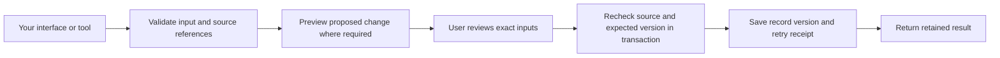

# Reuse QiMovi in your own system

Use QiMovi as a source of filmmaking workflows, data contracts, and application code. You can fork the application or selectively extract a feature into your own product. This guide uses the implementation in the 0.6 alpha line; **there is no separately packaged QiMovi SDK or promise of a stable public API**. Pin the upstream commit you adopt and review later changes before updating your copy.

Here, “reuse” or “extract” means copying the relevant **source code and its dependencies**. Scraping the rendered UI will not recover the validation, history, or source relationships that make the workflow useful.

## Choose how much to adopt

| Approach | Best fit | What you take | What you provide |
|---|---|---|---|
| Run the existing local service | You want most production features with a different UI or desktop shell. | Local server, contracts, kernel, runtime dependencies, and an isolated workspace. | Your local host/UI, authenticated transport adapter, installation and backup process. |
| Extract one feature slice | You already have storage, authentication and a product workflow. | A narrow contract/model, its transitive imports and required data files; selected UI if useful. | Mapping to your identities and repositories, validation on writes, conflict handling and your presentation. |
| Fork the full application | You want a filmmaking product close to QiMovi's current scope. | React application, local service, and whichever native targets you need. | Cleared branding/content, your signing and distribution, configured integrations and product support. |

**Recommended starting point:** reuse the service intact for a broad integration; use narrow contracts for a small feature. Several server modules import a large shared storage/validation graph. Copying a panel or one service file alone is usually insufficient.

## Which modules matter most, and why

Priority here means **dependency and product value**, not a claim that a module is complete or production-certified. Start with the first two rows; then choose the filmmaking features your users need.

| Priority / module | Why it matters | Source to start with | Porting boundary |
|---|---|---|---|
| **1. Identity, contracts and canonical data** | Keeps project, scene, shot, asset and record references meaningful across tools. Hashes and previews depend on consistent serialization. | [Contracts](local/contracts/), [canonical core](local/kernel/src/canonical-json-core.mjs), [UI types](src/drifter/types.ts) | Preserve schema IDs, validation and hashing rules. The broad [record dispatcher](local/contracts/drifter.mjs) includes Node imports; it is not a browser-only library. |
| **2. Storage, history and admission** | Protects authored work through versions, conflict detection, replay receipts and recovery. Keeps editable work separate from admitted state. | [WorkspaceStore](local/server/storage.mjs), [recovery](local/server/recovery.mjs), [kernel adapter](local/server/kernel.mjs), [admission](local/server/admission.mjs) | Node/SQLite/filesystem with broad domain dependencies. Reuse the service or deliberately implement equivalent repository operations. Keep editable and canonical stores separate. |
| **3. Screenplay → scene → shot** | Makes downstream work traceable to the exact writing revision and coverage plan. Essential for connecting a writing product to production. | [Screenplay index](local/contracts/screenplay-index.mjs), [writing production contract](local/contracts/writing-production.mjs), [production attachment](local/contracts/production-attachment.mjs), [service](local/server/writing-production.mjs) | Parsing is small; stable scene identity, attachment and revision checks need the wider workflow. Later writing must not silently replace the production source. |
| **4. Story Bible and asset Library** | Lets character/world intentions, citations and reusable media serve multiple scenes and outputs without duplicating their identity. | [Universe contract](local/contracts/universe.mjs), [profile questions](local/contracts/universe-profile.mjs), [Universe service](local/server/universe.mjs), [Library service](local/server/project-library.mjs), [profile editor](src/drifter/UniverseProfileEditor.tsx) | Retain citations and review state. Profiles are author intentions; source observations, character knowledge and canon decisions have separate meanings. |
| **5. Storyboard, measured media and editorial sequence** | Connects planned images to real returned files, candidate takes and editing choices. This is the central production chain. | [Storyboard planning](local/contracts/storyboard-planning.mjs), [media contract](local/contracts/media-takes.mjs), [media intake](local/server/media-takes.mjs), [movie sequence](local/contracts/movie-sequence.mjs), [timeline](src/drifter/MovieTimeline.tsx) | Carry exact frame/shot links, file provenance, measurements and retained take references. A planning image or capture flag must not become accepted footage. |
| **6. Budget and usage accounting** | Links work and assets to estimates, commitments and evidenced costs. Shared work can appear in multiple views without being counted as a new charge. | [Budget calculations](local/contracts/production-budget.mjs), [budget inventory service](local/server/production-budget.mjs), [usage contract](local/contracts/usage-accounting.mjs), [usage service](local/server/usage-accounting.mjs) | Use decimal strings and explicit currencies. Preserve unknown rates, estimate bases and unique actual/observation references. Cost tracking is not a payment processor. |
| **7. Node workflow and helpful data entry** | Shows dependencies and directs the user to the next useful tool or unanswered question. | [Graph contract](local/contracts/node-workflow.mjs), [workflow service](local/server/node-workflow.mjs), [node UI](src/drifter/NodeWorkspacePanel.tsx), [Movie desk needs](src/drifter/movieDeskNeeds.ts) | Reuse graph validation before the visualization. A connector node is not proof of a runnable integration; missing-data prompts are not completion or approval scores. |
| **8. Phone planning and PreViz exchange** | Supports a smaller field companion with explicit review of edits and shot-linked rehearsal references. | [Phone handoff](local/server/phone-handoff.mjs), [phone artifact contract](local/contracts/phone-previz.mjs), [retention service](local/server/phone-previz.mjs), [Swift models](iphone/QiMovi/ProductionModels.swift), [clapper store](iphone/QiMovi/ClapperStore.swift) | Manual files, source baselines, review and individual apply actions. Core Motion/UI are Apple-specific. Rotation is orientation only; clapper marks are not synchronized timecode. |
| **9. DCC, editor and provider adapters** | Extends a coherent film workflow into Blender, Unity, Resolve or generation services. | [PreViz integration guide](local/integrations/three-d/README.md), [DCC exchange](local/integrations/three-d/exchange.mjs), [Resolve service](local/server/resolve-mcp.mjs), [Higgsfield service](local/server/higgsfield-mcp.mjs) | Adopt after source/media/workflow foundations. Supply compatible runtimes and your own accounts; verify execution and returned evidence for each adapter. |

For a **writing/worldbuilding product**, prioritize 1–4 and 7. For a **production tracker**, prioritize 1–3, 5–7. For a **camera companion**, start with 1 and 8, then connect reviewed returns to 5 and 9. Rights/participation, preservation, comics, pitch documents and marketing are additional feature slices; their records and exports do not establish legal rights, financial value or release readiness.

## Start with a small, runnable extraction

Clone the public repository and record the revision you are using:

```sh
git clone https://github.com/cr8ph8/QiMovi.git
cd QiMovi
git rev-parse HEAD
node examples/reuse-core.mjs
```

Use Node 24.10+ as documented in [QUICKSTART.md](QUICKSTART.md). The [example](examples/reuse-core.mjs) has no third-party package imports and does not require `bun install`. It indexes a synthetic screenplay without changing its text, reads character-development questions, and calculates a synthetic two-day rental. Its assertions establish `"250"` as the estimate, `null` for an unknown rate, and `"0"` for a stated zero rate with a basis. It writes nothing and calls no provider.

These small import sets are useful starting points in the current source:

| Capability | Files to retain together | Runtime considerations |
|---|---|---|
| Screenplay recognition/index | `local/contracts/screenplay-index.mjs` + `screenplay-elements.mjs` | Standard JS; optional span hashing uses Web Crypto. Positional index IDs are not persistent scene IDs. |
| Character/world question definitions | `local/contracts/universe-profile.mjs` | Standard modern JS. Full persisted profile validation also belongs to `universe.mjs`; field validation alone is insufficient. |
| Budget record validation/calculation | `local/contracts/production-budget.mjs` + `creative-project.mjs` | Modern JS with BigInt. Validate before calculation. This excludes inventory collection, storage and real usage/provider integration. |
| Phone rotation/clapper validation | `local/contracts/phone-previz.mjs` | No imports. Includes its own bounded floating-point serializer. It does not retain files or apply camera motion. |
| Canonical record serialization | `local/kernel/src/canonical-json-core.mjs` + `errors.mjs` | Standard JS. Node hashing is in `canonical-json.mjs`; the browser counterpart is `src/drifter/canonical.ts`. |

Keep relative directory structure when copying these files. Copy the relevant `.d.mts` declarations if your consumer uses TypeScript. Record the upstream commit, original path, local destination, dependency list and local changes in your own vendor manifest. Preserve the original license notice. These sets are starting points, not permanently frozen packages; inspect imports again when updating.

For example, from the cloned repository, this copies only the runnable example's current dependency set to a **new** folder in your product:

```sh
QI_VENDOR="$HOME/Projects/MyFilmApp/vendor/qimovi"
# Choose a destination that does not already contain an adopted copy.
if test -e "$QI_VENDOR"; then
  printf 'Destination exists; review it before updating.\n'
else
  mkdir -p "$QI_VENDOR/local/contracts" "$QI_VENDOR/examples"
  cp LICENSE NOTICE "$QI_VENDOR/"
  cp local/contracts/screenplay-index.mjs local/contracts/screenplay-elements.mjs \
    local/contracts/universe-profile.mjs local/contracts/creative-project.mjs \
    local/contracts/production-budget.mjs "$QI_VENDOR/local/contracts/"
  cp examples/reuse-core.mjs "$QI_VENDOR/examples/"
  git rev-parse HEAD > "$QI_VENDOR/UPSTREAM_COMMIT"
  node "$QI_VENDOR/examples/reuse-core.mjs"
fi
```

Replace the example destination with your own project path. This copies original code/documentation only; it does not copy branding, images, credentials or film data. Wider feature slices can introduce third-party dependencies and their notices.

For another language, port the schemas and semantics rather than just the function names. Preserve decimal precision, null handling, error cases, limits, ID scope and exact hashing bytes. Cross-language source ranges need special care: the JS screenplay index uses JavaScript string offsets. Run the same synthetic examples through both implementations before treating their records as interchangeable.

## Integrate a replacement interface with the existing service

1. Follow [QUICKSTART.md](QUICKSTART.md) to create a **new empty workspace** and run the local service. Production databases and credentials do not belong inside your source checkout.
2. Read [WorkspaceApi](src/drifter/types.ts) and its [HTTP implementation](src/drifter/api.ts). [App.tsx](src/drifter/App.tsx) accepts an injected `api`; the methods are a useful adapter seam, not a stable SDK contract. Some feature panels also use separate API helpers, so inventory each feature's calls.
3. Keep the UI and local session inside the intended local host boundary. The native Mac implementation in [LocalService.swift](desktop/Sources/QiMovieSlate/LocalService.swift) shows lifecycle/authentication; [StudioWebView.swift](desktop/Sources/QiMovieSlate/StudioWebView.swift) shows its WebKit host. A new host must implement its own equivalent lifecycle and credential handling.
4. Preserve per-operation validation, expected versions and retry identifiers. Expose conflicts and retain the user's working draft. Use the existing service operations rather than writing its SQLite tables from another app.
5. Adapt panels gradually: first read a project, then edit/save/reopen one draft, then connect one source-bound downstream feature. Carry each panel's neighboring hooks, CSS, data files and API helpers, or replace the presentation while keeping its behavior.

The local server checks exact Host/Origin and local sessions. **Do not add wildcard CORS or expose the loopback server publicly to make a port work.** A browser extension, another web origin, an Electron/Tauri host, or a hosted multi-user product needs a deliberately designed authenticated bridge. The current Mac host is AppKit/WebKit; Electron/Tauri hosts are not provided here. The separate CanIScreenwrite bridge has narrower permissions than an owner session. See [SECURITY.md](SECURITY.md).

## Preserve the complete write path



This is the review/apply pattern used by the phone handoff; ordinary authoring saves have their own operations. Preserve each operation's actual rules rather than inventing one universal approval flag.

- Bind related work to project/source/scene/shot and retained record versions as appropriate. A source-free creative project and its later production attachment must preserve their original ownership rules.
- Keep an exact retry tied to the same request identity and payload. Changed intent is a new request. Do not silently retry a conflict with the newest version number.
- Recompute a preview at apply time where the service does so. A preview from an earlier source revision cannot authorize a later change.
- Keep raw source text, parsed observations, editable drafts, admission, media measurements and candidate review distinct. A hash is content identity, not a signature or rights clearance.
- Authoritative canonical records use safe integers/decimal strings; phone sensor artifacts use their separate bounded float serializer. Ordinary `JSON.stringify` is not a replacement for canonical hashing.

## Fork the full app without carrying another production into it

Use `drifter.html` and `vite.local.config.ts` for the maintained local UI. The historical `src/drifter/` folder name does not bind your fork to a film. The inherited hosted `src/` and `supabase/` surfaces are not a ready hosted deployment.

For a derivative product:

- Change visible app naming and cleared icons in your fork. Use your own bundle identifiers, signing team and distribution configuration. Follow the native build sections of [QUICKSTART.md](QUICKSTART.md).
- Keep retained schema identifiers such as `qimovi-*`, `caniscreenwrite-*` and `filmstack-*` unless you intentionally version and migrate the protocol. A bulk branding replacement can break imports and stored records.
- Start with a new workspace and synthetic/cleared content. Never copy `config.json`, production databases, app-container backups, private source folders or provider credentials into a repository or installer.
- Add only the external adapters you will support. Connector code provides neither the application license nor the maintainer's subscriptions/MCP sessions. Keep credentials in your host's private configuration.
- Keep QiCanIScreenwrite a separately identified peer when using its exchange paths. Sharing writing code does not establish live synchronization with that separate product.

## Check the slice you actually ported

Start with the runnable example, then select checks for the changed boundary:

| Port | Useful existing checks / acceptance work |
|---|---|
| UI/API wrapper | `bun run typecheck`, `bun run build:local`, plus the relevant UI test script in `package.json`. Verify one save, reload and conflict in a synthetic workspace. |
| Workspace/HTTP | `node --test tests/local-workspace.test.mjs`; verify backup/restore, private sessions and single-writer behavior in your new host. |
| Phone planning | `node --test tests/phone-handoff.test.mjs`; verify source changes, retained baselines and exact retries. |
| Phone PreViz | `node --test tests/phone-previz.test.mjs`; verify artifact validation, content integrity and reviewed retention. |
| Guided data entry / contact sheets | `bun run test:workspace-ui`; check missing-data navigation, non-overwrite and frame/candidate identity. |
| Native phone | `bash iphone/scripts/check-planning.sh` and `bash iphone/scripts/check-clapper.sh`, then an Xcode build and real device use for sensor/cue behavior. |
| DCC/editor/provider | Synthetic unit checks are only a start. Verify compatible runtime → execution → returned files → measurement/review → intended receiving record. |

There is no dedicated standalone budget-contract suite in this public tree; the runnable example is a narrow arithmetic/unknown-value check, not proof of a complete financial workflow. For a budget port, add cases for your currency, shared-work rollups, duplicate actuals, refunds, reconciliation and source/ownership changes before relying on it.

The codebase remains alpha. Source compatibility, local tests, a successful build, an installed app and an accepted real production are different milestones. Live phone sync, calibrated phone-to-DCC camera playback, synchronized clapper timecode, and a hosted multi-user service are not supplied by this porting guide.

## Rights and attribution

Under this repository's [MIT License](LICENSE), the original software code and documentation can be copied, modified and incorporated into another system, including a commercial product, with the required copyright/license notice retained. Keep [NOTICE](NOTICE) with the scope information and review [THIRD_PARTY_NOTICES.md](THIRD_PARTY_NOTICES.md) for components you carry into your distribution.

The repository reserves film materials, characters, screenplays, performances, private production records and QiMovi/QiCanIScreenwrite/Quotient Intelligent branding. Use your own cleared content and branding. An asset hash, market-preparation record or NFT-related function grants no ownership or trading rights. References to external tools and educational works do not relicense those products or works.

For ongoing changes, use [CONTRIBUTING.md](CONTRIBUTING.md) and document which upstream revision your integration supports.
